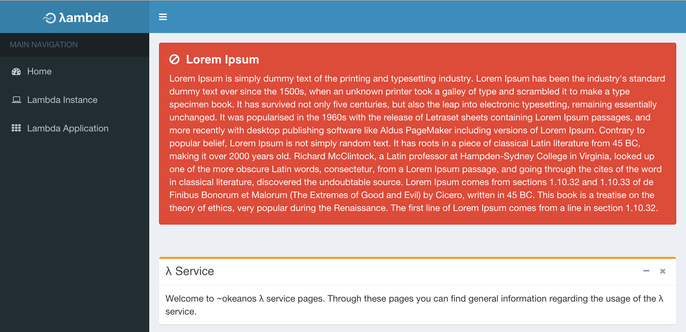

# Messages on the central service

## Description

This guide describes how to publish a message on the [Central service](https://lambda.grnet.gr) of the service. This guide is intended to be used only by the administrators of the central service VM. 

## 

The administrator of the central service must first login the machine using ssh and become the `root` user. From the command line provide the following command 

```sh
$ cd /var/www/okeanos-LoD/central_service/app/frontend
```

to navigate to the appropriate folder. In order to publish (or remove) a message from the central service web interface the python script `admin-message.py` (located in the aforementioned folder) may be used. 

The following command prints out the help message related to this script:

```sh
$ python admin-message.py --help
usage: admin-message.py [-h] [--action {set,remove}] [--title TITLE]
                        [--message MESSAGE]
                        [--type {danger,warning,info,success}]

Admin Message

optional arguments:
  -h, --help            show this help message and exit
  --action {set,remove}
                        set or remove an admin message (default: set)
  --title TITLE         title of the admin message (used only with set action,
                        default:"Title")
  --message MESSAGE     admin message (used only with set action,
                        default="Message")
  --type {danger,warning,info,success}
                        the type of the message (used only with set action,
                        default="info")
```

In order to add a new message to the central web interface the `set` action should be used. The `--title` and `--message` arguments accept text as their arguments. Based on the the message itself (its contents) an appropriate `--type` should be used alongside (`info` for blue background, `success` for green, `warning` for orange and `danger` for red).

The following command will generate a "Lorem Ipsum" message on the central web interface
as it is shown also on the screenshot picture below. 

```sh
$ python admin-message.py --action set \
  --title "Lorem Ipsum" \
  --message "Lorem Ipsum is ..." \
  --type danger
```

Result:



To remove the message the `remove` action should be used (without any further arguments), like so:

```sh
$ python admin-message.py --action remove
```