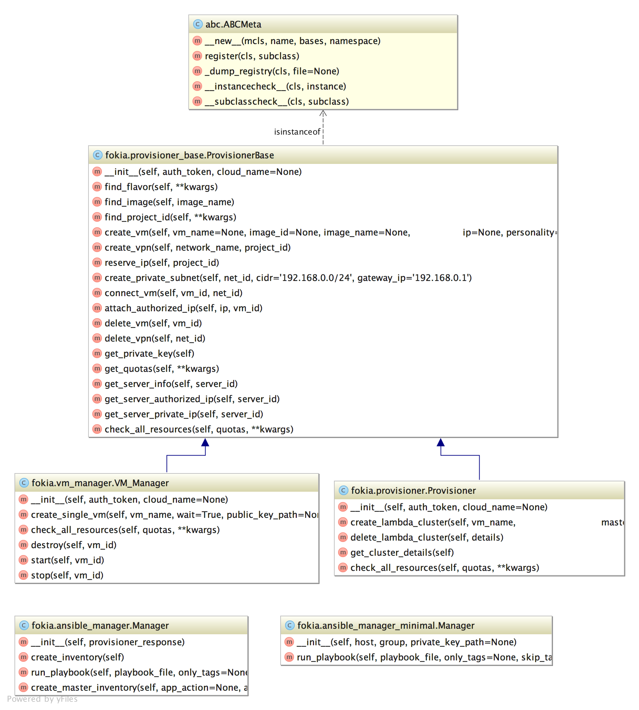
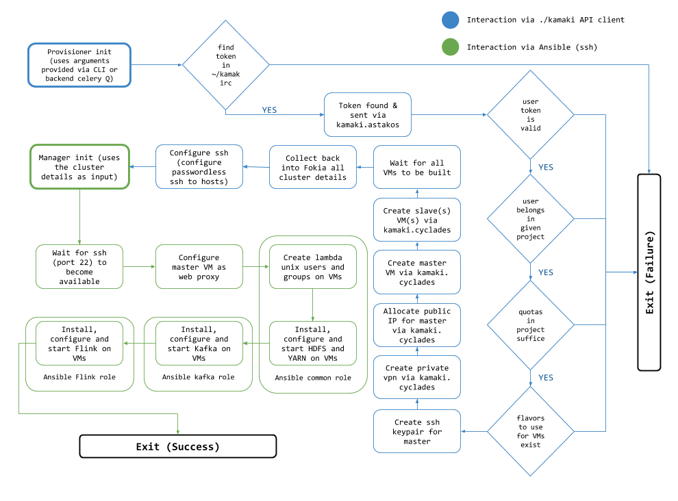

## Overview

The Fokia library is used internally by the λ service in order to bootstrap and orchestrate ~okeanos resources (VMs, virtual networks, disks etc). Internally, Fokia implements calls to the ~okeanos API via the kamaki library and orchestrates the provisioned resources via the Ansible API library. 

## UML Class diagram

The Fokia UML class diagram is the following one:

The Fokia library is installed on each λ service VM. 

## Fokia Flowchart

The following flowchart displays the procedures followed by Fokia when creating a new λ instance. 

