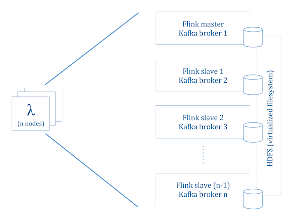
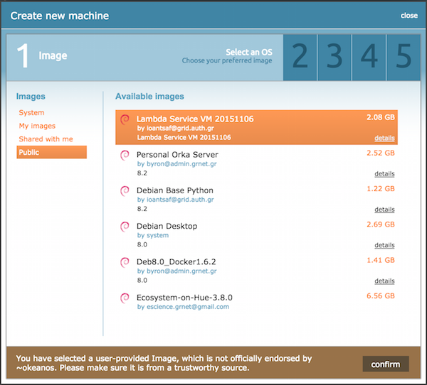
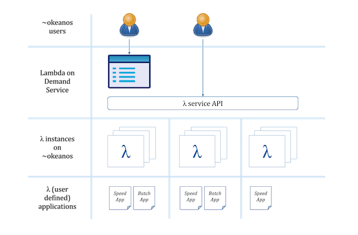

# λ on Demand

These pages contain technical documentation regarding the Lambda on Demand service. The service targets ~okeanos users that want to deploy a fully capable λ instance (cluster) on top of ~okeanos resources. 

## Description of λ (lambda) instance

Each λ instance provided through the service is comprised of the following building blocks:

- A YARN based hadoop infrastructure with HDFS
- A Flink based cluster running on top of YARN
- A Kafka brokering service (incl. Zookeper for service node discovery)

A λ instance comprised of `n` nodes (VMs) will contain `n` HDFS nodes, one Flink master and `n-1` Flink slaves, and `n` Kafka brokers as shown in the screenshot below

## How the service works

In order to use the service an ~okeanos user will first need to spin up a service virtual machine on ~okeanos. To do so one needs to select and use the 'Lambda (λ) Service VM' image as shown on the screenshot below. 

## Provisioning a λ instance

After spinning up a λ Service VM the user of the service can utilize λ instances on demand either through the service API or through the service web frontend as shown in the screenshot below. 

The web front interface uses the API interface in the backend. More details on the API interface are available [here](service-api/index.md). 

The API interface uses the Fokia library in its backend. More details on the Fokia library are available [here](fokia/description.md).

