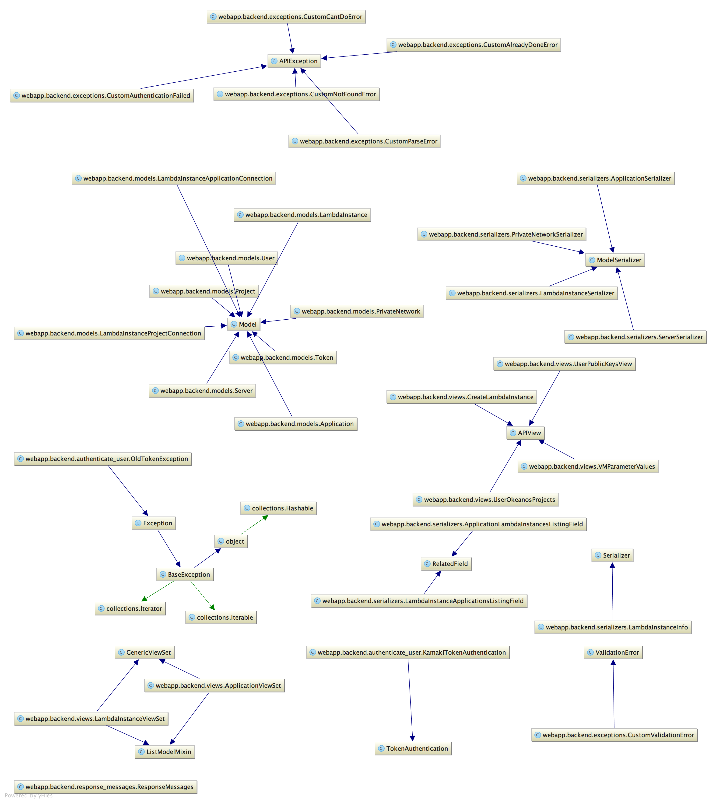
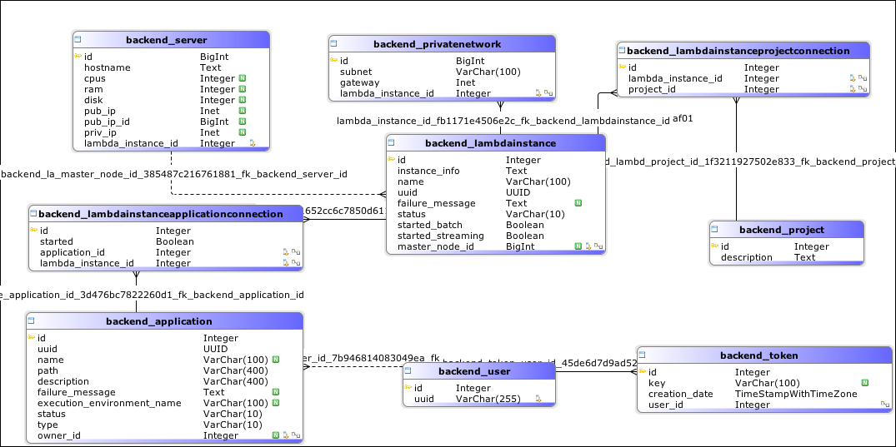

## λ service API

The service API UML Class diagram is shown in the following picture. 

Documentation on using the λ service API as well as usage examples are available [here](index.md)

## λ service database

A postgresql database is installed on each λ service. The schema of the database is given in the following screenshot. 

## CQRS implementation

On each λ service resource three Celery queues are available. These are:

- Tasks queue
- Events queue
- Statistics queue

The first one (Tasks queue) delivers tasks through the API to the Fokia library. Fokia functions are registered as Celery tasks on the backend layer. By default up to two tasks may be executed on the Tasks queue at any given time. 

The events queue withholds and executes tasks that alter the contents of the λ service database. Tasks to the event queue are delivered through tasks being executed on the Tasks queue. By default one event task executes at any given time. 

Tasks to the statistics queue are published once again through the Tasks queue. These alter the value of the metrics collected on the central instance. 

